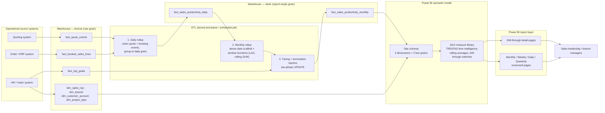

# Architecture

## Data flow



This repo implements everything left of the "Power BI semantic model" box
end-to-end and runnable (`sql/` + `run_demo.py`); the model and report boxes
are documented in `dax/measures_library.md` and this file, since a live Power
BI workspace isn't something a `git clone` can reproduce.

## Why three ETL steps, not one query

**1. Daily rollup** exists because the two source streams (quotes, bookings)
arrive at different natural grains and with different keys. Reconciling them
once, at the finest useful grain, means every downstream step reads one clean
table instead of two raw ones.

**2. Monthly rollup** is the one worth understanding in detail: it takes the
(sparse) daily grain, rolls it up to month, then **crosses every partition
with every month in its active window** before computing anything, so the
grid has no gaps. Only after that is it dense does a window function
(`LAG()` for "prior month", `SUM() OVER (ROWS BETWEEN n PRECEDING AND 1
PRECEDING)` for rolling windows) become the right tool — window functions
compute relative to physical row position, and physical row position only
means "one calendar period" when there are no missing rows. Skipping the
density step and computing rolling windows with subqueries or self-joins
instead is the more common approach, but it re-scans the source rows for
every single output row and every one of the report's many rolling-window
measures, rather than once during a batch ETL run.

**3. Tiering + termination repress** runs last, and in two explicit phases,
because tiering must not count a rep who has already left. Repress runs
first and is a pure function of the roster (rep × termination date); tiering
reads the *already-repressed* rows and only segments the ones still marked
active. Reversing the order would let a departed rep's stale numbers still
show up in a "who needs coaching this month" tier for a month they weren't
around for.

## Star schema shape

```
                dim_date
                    |
dim_branch --- fact_sales_productivity_monthly --- dim_project_type
                    |                    |
              dim_sales_rep      dim_customer_account
```

`fact_sales_productivity_daily` shares the same dimension keys at daily
grain; `dim_date` joins to either fact table on its own date column
(`activity_date` on the daily table, `month_start_date` on the monthly one).
Production carries a third fact grain (weekly) built with the identical
dense-scaffold-plus-window-function technique — omitted here to keep the
walkthrough focused on demonstrating the pattern once, well, rather than
three times with minor variations.

## Scrubbing disclosure

Every table name, column name, business-rule threshold, and data value in
this repository is fictional. This repo demonstrates a *pattern* (multi-grain
fact design, dense time-series scaffolding for rolling metrics, a two-phase
repress-then-tier update, DAX time intelligence via `TREATAS` against a
pre-shaped fact table) applied to a fabricated small dataset for a fictional
company — it is not, and is not derived from, any employer's actual schema,
metric definitions, or data.
